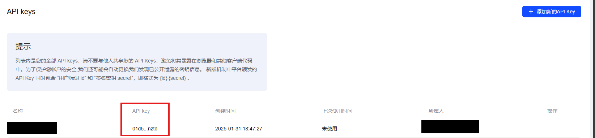

# Prerequisites

Before using this framework, several prerequisite dependencies need to be prepared:
- LLM API
- [MQTT](https://mqtt.org/)
- [PostgreSQL](https://www.postgresql.org/)
- [MLflow](https://mlflow.org/)

## LLM API

To use this framework, you **need access to LLM APIs**. We support multiple providers:

- [DeepSeek](https://deepseek.com/)
- [OpenAI](https://openai.com/)
- [Qwen](https://tongyi.aliyun.com/)
- [SiliconFlow](https://siliconflow.cn/)
- [ZhipuAI](https://chatglm.cn/)

```{admonition} Warning
:class: warning
For the best simulation results, we recommend using `DeepSeek-v3` to showcase the capabilities of LLM agents. 
However, be aware of the usage limits and costs from providers, as they often cannot meet the simulation needs.
```

As a simple example, you can use GLM-4-Flash, the free model provided by Zhipu.

Here is how to obtain the ZhipuAI API:
1. Visit https://open.bigmodel.cn/
2. Register an account and authorize yourself at https://open.bigmodel.cn/usercenter/settings/auth/
3. Create an API key of `GLM-4-Flash` (free model) at https://open.bigmodel.cn/usercenter/apikeys/

As shown in the figure below, you will have successfully acquired an API key.



## MQTT

PLACE-HOLDER

## PostgreSQL

PLACE-HOLDER

## MLflow

PLACE-HOLDER
