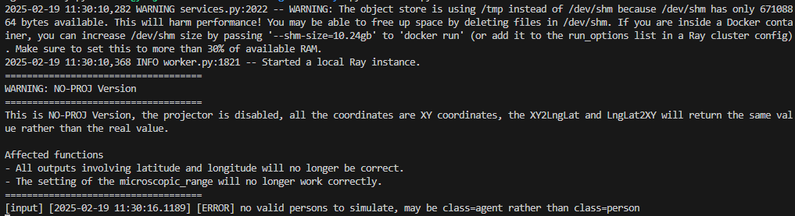
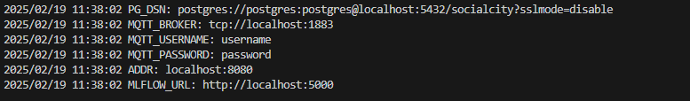
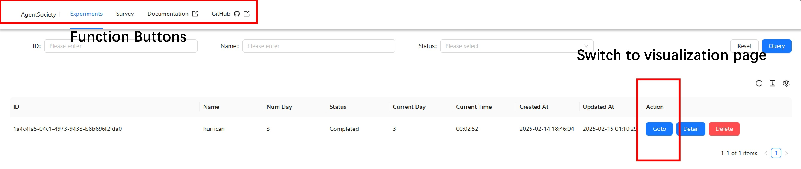

# Start Your First Simulation

Follow the steps below to begin our simulation of societal dynamics for 50 individuals over a period of 1 day in Beijing.

## Step 0: Installation

To install the necessary package, run the following command:

```bash
pip install agentsociety
```

```{admonition} Warning
:class: warning
This platform supports Linux x86, macOS x86, and macOS ARM. 
Please ensure your environment matches one of these supported platforms.
```

## Step 1: Download City Scene Data

Before the simulation starts, it is necessary to download the city scene data file of [Beijing](https://cloud.tsinghua.edu.cn/f/66315f47606b444281e5/?dl=1), and save it as `./data/beijing_map.pb`.

## Step 2: Edit Configurations

We need to create two configuration files:
1. A simulation environment configuration file (assumed filename: `example_sim_config.yaml`).
2. An experiment configuration file (assumed filename: `example_exp_config.yaml`).

An example of `example_sim_config.yaml` is as below:
```yaml
llm_request:
  request_type: zhipuai
  api_key: <YOUR-API-KEY> # Please replace with the API key obtained from the LLM provider website.
  model: GLM-4-Flash # The name of the model to be used.

simulator_request:
  task_name: "citysim" # The name of the simulation task, affect the directory name for log output
  max_day: 1 # Defines the maximum number of days for the simulation.
  start_step: 0 # The initial step of the simulation in seconds.
  total_step: 86400 # Total steps in the simulation in seconds.
  log_dir: log # Directory where simulator logs will be stored.
  min_step_time: 1000 # Minimum execution time (in milliseconds) per step.

mqtt:
  server: <MQTT-BROKER> # Specify the MQTT server address here.
  port: 1883 # Port number on which the MQTT service is running.
  username: <USER-NAME> # Username for MQTT server authentication.
  password: <PASSWORD> # Password for MQTT server authentication.

map_request:
  file_path: data/beijing_map.pb # Path to the map file, reference to step1.

metric_request:
  mlflow: 
      username: <USER-NAME> # Username for MLflow authentication.
      password: <PASSWORD> # Password for MLflow authentication.
      mlflow_uri: <MLFLOW-URI> # URI pointing to the MLflow tracking server.

pgsql:
  enabled: true # Whether PostgreSQL database integration is enabled.
  dsn: <DSN> # Data source name for connecting to PostgreSQL.

avro:
  enabled: true # Whether Avro serialization is enabled.
  path: <AVRO-PATH> # Directory path for storing cached data or serialized files.

```

```{admonition} Attention
:class: attention
Please replace all placeholders enclosed in < > in the above configuration file with the correct values.
```
An example of `example_exp_config.yaml` is as below:
```yaml
agent_config:
  number_of_citizen: 100  # Number of citizens
  enable_institution: false  # Whether institutions are enabled in the experiment

workflow: [
  {"type": "run", "days": 1} # run the simulation for one day
]

```

```{admonition} Info
:class: info
In addition to directly loading configuration files, we also support configuring parameters programmatically through code. 
For more details and code examples, please refer to the [Fluent API Configuration](../02-configurations/index.md).
```

## Step 3：Launch the Simulation

```python
from agentsociety.configs import (ExpConfig, SimConfig, WorkflowStep,
                                 load_config_from_file)
from agentsociety.simulation import AgentSimulation

sim_config = load_config_from_file("examples/config_templates/example_sim_config.yaml", SimConfig)
exp_config = load_config_from_file("examples/config_templates/example_exp_config.yaml", ExpConfig)

async def main():
    simulation = AgentSimulation.run_from_config(
        config=exp_config,
        sim_config=sim_config,
    )
    await simulation


if __name__ == "__main__":
    import asyncio

    asyncio.run(main())

```

After adjusting the configuration files, running the Python code above will produce the following command-line output, indicating that the simulation has been successfully launched.



## Step4：View the Results

```{admonition} Caution
:class: caution
To use this interface, you MUST deploy PostgreSQL, MLflow and MQTT first.
```

When the simulation is done, you can use our visualization tool within the python package `agentsociety-ui` to replay the simulation.
An example config file (assumed filename: `ui_config.yaml`) is as follow:

```yaml
addr: localhost:8080 # Address for the UI service
mqtt-broker: <MQTT-BROKER> # MQTT broker address
mqtt-username: <USER-NAME> # Username for MQTT.
mqtt-password: <PASSWORD> # Password for MQTT.
pg-dsn: <DSN> # PostgreSQL DSN for database connection.
mlflow-url: <MLFLOW-URI> # URL for MLflow server 
```

To activate the ui interface, you simply need to code these in your terminal. 
```bash
agentsociety-ui --config ui_config.yaml
```

Running the code above will activate the UI Interface, as shown below.



 

## Next Step

Congratulations🎇! Now that we have successfully completed a large model-driven social simulation, let's take it a step further and explore how to modify certain settings in the virtual world to [conduct social experiments](./03-conduct-your-first-experiment.md).
