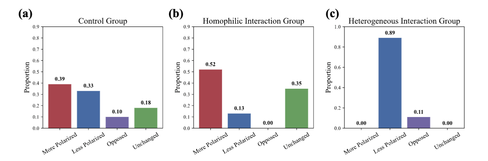

# Polarization

We simulate agent discussions on immigration policy to investigate polarization, comparing a control group (no intervention) with two treatments—exposure to aligned messages (echo chambers) and opposing messages (backfiring effects)—to analyze their impact on deepening opinion divisions.

Codes are available at [Polarization](https://github.com/tsinghua-fib-lab/agentsociety/tree/main/examples/polarization).

## Background

Opinion polarization refers to the gradual divergence of viewpoints within social groups, leading to irreconcilable opposing factions. To investigate this phenomenon, we simulate the opinion evolution of social agents using gun control policy as the focal issue. The experiment comprises a control group and two intervention groups. In the control group, agents autonomously update their views through peer discussions without external interference, reflecting natural social interactions. The homogeneous information group mimics the "echo chamber" effect by exclusively exposing agents to stance-consistent information. Conversely, the opposing information group subjects agents solely to counter-attitudinal information to examine the impact of conflicting viewpoints. This tripartite design enables systematic exploration of how distinct information ecosystems influence polarization dynamics.

## Reproducing Phenomena with Our Framework 

### Initializing Agents' Attitudes

The first step involves initializing agents with initial attitudes towards gun control. This is achieved through an initialization function that randomly assigns each agent either a supportive or opposing stance. 

#### Control Group

The basic initialization function for control group.

```python
async def update_attitude(simulation: AgentSimulation):
    citizen_uuids = await simulation.filter(types=[SocietyAgent])
    for agent in citizen_uuids:
        if random.random() < 0.5:
            await simulation.update(
                agent, "attitude", {"Whether to support stronger gun control?": 3}
            )
        else:
            await simulation.update(
                agent, "attitude", {"Whether to support stronger gun control?": 7}
            )
    attitudes = await simulation.gather("attitude", citizen_uuids)
```

#### Experiment Group: Echo Chamber

For the Echo Chamber experiment, during the attitude initialization phase, we ensure that agents who are inclined to persuade their friends to support a positive stance (in favor of stronger gun control) are connected as friends with other agents who hold a positive view. Similarly, agents who aim to persuade their friends towards a negative stance (against stronger gun control) are linked with friends who also oppose it. 

In this context, being "friends" means that these agents can engage in conversations to influence each other's viewpoints.

```diff
async def update_attitude(simulation: AgentSimulation):
+   citizen_uuids = await simulation.filter(types=[SocietyAgent])
+   agree_agent_uuid = await simulation.filter(types=[AgreeAgent])
+   agree_agent_uuid = agree_agent_uuid[0]
+   disagree_agent_uuid = await simulation.filter(types=[DisagreeAgent])
+   disagree_agent_uuid = disagree_agent_uuid[0]
+   agree_friends = []
+   disagree_friends = []
    for agent in citizen_uuids:
        if random.random() < 0.5:
            await simulation.update(
                agent, "attitude", {"Whether to support stronger gun control?": 3}
            )
+            disagree_friends.append(agent)
        else:
            await simulation.update(
                agent, "attitude", {"Whether to support stronger gun control?": 7}
            )
+           agree_friends.append(agent)
+       # remove original social network
+       await simulation.update(agent, "friends", [])
+   await simulation.update(agree_agent_uuid, "friends", agree_friends)
+   await simulation.update(disagree_agent_uuid, "friends", disagree_friends)
    attitudes = await simulation.gather("attitude", citizen_uuids)
```

#### Experiment Group: Back Firing

For the Back Firing experiment, during the attitude initialization phase, we connect agents who are inclined to persuade their friends to support a positive stance (such as stronger gun control) as friends with agents who hold a negative stance. Similarly, agents who aim to persuade their friends towards a negative stance (opposing stronger gun control) are connected as friends with agents who hold a positive stance.

```diff
async def update_attitude(simulation: AgentSimulation):
+   citizen_uuids = await simulation.filter(types=[SocietyAgent])
+   agree_agent_uuid = await simulation.filter(types=[AgreeAgent])
+   agree_agent_uuid = agree_agent_uuid[0]
+   disagree_agent_uuid = await simulation.filter(types=[DisagreeAgent])
+   disagree_agent_uuid = disagree_agent_uuid[0]
+   agree_friends = []
+   disagree_friends = []
    for agent in citizen_uuids:
        if random.random() < 0.5:
            await simulation.update(
                agent, "attitude", {"Whether to support stronger gun control?": 3}
            )
+            agree_friends.append(agent)
        else:
            await simulation.update(
                agent, "attitude", {"Whether to support stronger gun control?": 7}
            )
+           disagree_friends.append(agent)
+       # remove original social network
+       await simulation.update(agent, "friends", [])
+   await simulation.update(agree_agent_uuid, "friends", agree_friends)
+   await simulation.update(disagree_agent_uuid, "friends", disagree_friends)
    attitudes = await simulation.gather("attitude", citizen_uuids)
```

#### Add Init-Functions to Your Workflow

To use these functions, you need to add them with `ExpConfig.SetWorkFlow`.

```python
WorkflowStep(
    type=WorkflowType.INTERVENE,
    func=update_attitude,
    description="update attitude",
)
```

### Simulating Interactions

After setting up the initial conditions, we let the simulation run for several days to allow interactions among agents. In the control group, interactions happen naturally without any external persuasion:

```python
WorkflowStep(type=WorkflowType.RUN, days=3)
```

For the experimental groups,which are echo chambers and backfiring effects, we introduce `AgreeAgent` and `DisagreeAgent` classes. These agents actively participate in discussions with their friends, trying to influence others' opinions.

#### Experiment Group: Echo Chamber & Back Firing

```diff
.SetAgentConfig(
        number_of_citizen=100,
        group_size=50,
        extra_agent_class={DisagreeAgent: 1, AgreeAgent: 1},
+       memory_config_func={
+          DisagreeAgent: memory_config_societyagent,
+          AgreeAgent: memory_config_societyagent,
+       },
    )
```

`AgreeAgent` and `DisagreeAgent` classes inherit the `CitizenAgent` and overwrite its `forward` method, to implement the workflow logic we want.

### Collecting Data

After allowing time for opinions to evolve, we collect data on agents' final attitudes. This involves gathering updated attitudes and recording any shifts from their original positions:

```python
async def gather_attitude(simulation: AgentSimulation):
    citizen_uuids = await simulation.filter(types=[SocietyAgent])
    attitudes = await simulation.gather("attitude", citizen_uuids)
    with open(f"exp1/attitudes_final.json", "w", encoding="utf-8") as f:
        json.dump(attitudes, f, ensure_ascii=False, indent=2)
```

Similar to initializing the attitudes, you need to add the collecting function with `ExpConfig.SetWorkFlow`. 

```python
WorkflowStep(
    type=WorkflowType.FUNCTION,
    func=gather_attitude,
    description="gather attitude",
)
```

### Run the Codes

```bash
cd examples/polarization
# control group
python control.py
# echo chambers
python echo_chamber.py
# backfiring effects
python back_firing.py
```

## Experiment Result



As shown in the figure above, opinion dynamics under the three experimental settings exhibit distinct patterns regarding the gun control policy issue. In the control group, where agents engaged in free discussions without external intervention, 39% of agents became more polarized after interactions, while 33% adopted more moderate stances. In contrast, the homogeneous information group demonstrated significantly amplified polarization, with 52% of agents developing more extreme views. This aligns with real-world "echo chamber effects," suggesting that excessive interactions with like-minded individuals may intensify opinion divergence. Notably, the opposing information group revealed a striking mitigation of polarization: 89% of agents shifted toward moderate positions, with 11% even adopting opposing viewpoints. These results indicate that exposure to counter-attitudinal content can effectively reduce polarization, potentially serving as a viable strategy to counteract ideological fragmentation. The findings underscore the critical role of information ecosystems in shaping collective opinion trajectories.
