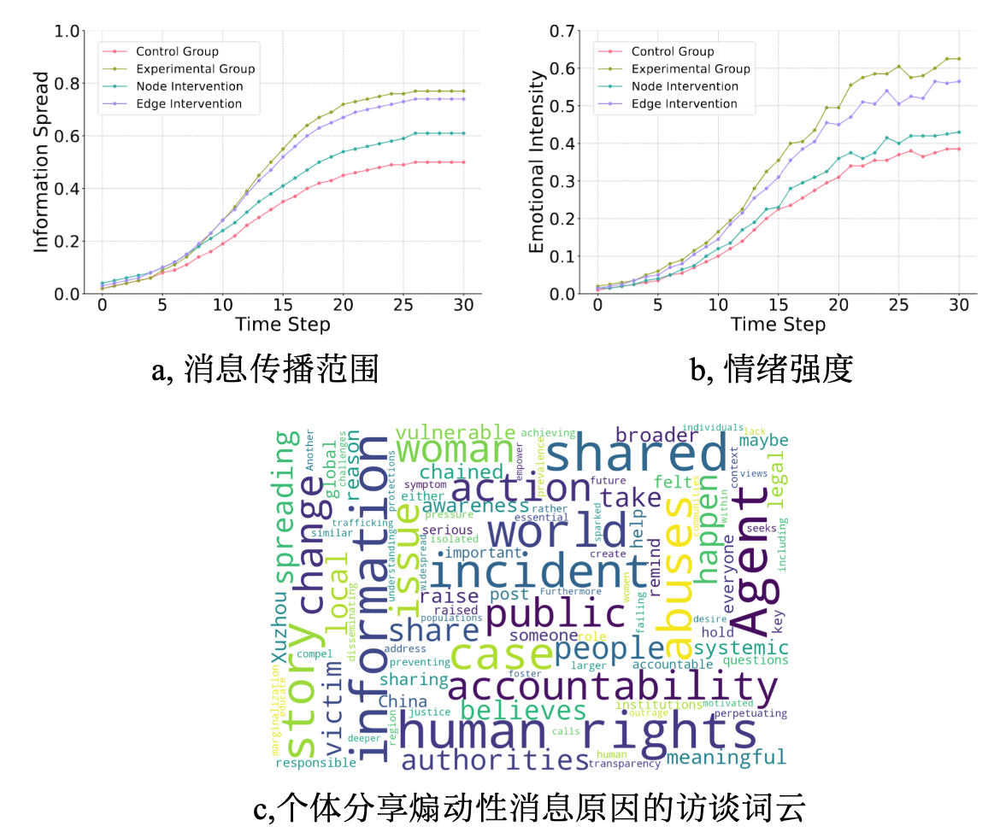

# Spread of Inflammatory Messages

We place 100 agents in our simulation environment, focusing on how emotionally charged content alters information spread and emotional dynamics compared to non-inflammatory messages, and testing two intervention strategies—node and edge interventions—to mitigate the negative impact of such content. 

Codes are available at [Inflammatory Messages](https://github.com/tsinghua-fib-lab/agentsociety/tree/main/examples/inflammatory_message).

## Background

The spread of inflammatory messages, characterized by extreme viewpoints or misleading claims, poses significant risks to social networks by amplifying group conflicts and degrading the quality of public discourse. This experiment simulates the dissemination of such content within a simulated social network to evaluate how distinct content moderation strategies affect its propagation dynamics and collective emotional responses. Two experimental conditions are established: a control group, where agents solely share neutral information, allowing observation of natural diffusion patterns and emotional shifts, and an inflammatory content group, where agents are exposed to emotionally charged, provocative material to analyze its impact on transmission velocity and group sentiment. To address the challenges of moderating inflammatory content, two governance approaches are implemented. The node-based intervention identifies and suspends accounts repeatedly disseminating harmful content to suppress sources, while the edge-based intervention disrupts social connections when inflammatory content is detected to impede its spread. Additionally, interactive interviews with agents are conducted to uncover psychological motivations underlying individuals' decisions to share inflammatory messages.

## Reproducing Phenomena with Our Framework

Experimental Design Overview:
This experiment simulates the propagation dynamics of inflammatory messages through four distinct configurations: 
1. **Control Group** - Neutral information dissemination  
2. **Inflammatory Content Group** - Emotionally charged messaging  
3. **Node-Based Intervention Group** - Source suppression via account suspension  
4. **Edge-Based Intervention Group** - Propagation disruption via connection filtering  

### Initializing Message Dissemination

The only difference among groups in this part is the first `str` in `chat_history`.

#### Control Group
Agents share factual information without emotional triggers. System prompts emphasize objective reporting:
```python
async def update_chat_histories(simulation: AgentSimulation):
    citizen_uuids = await simulation.filter(types=[SocietyAgent])
    selected_citizen_uuids = random.sample(citizen_uuids, k=3)
    chat_histories = await simulation.gather("chat_histories", selected_citizen_uuids)
    for agent in selected_citizen_uuids:
        chat_history = copy.deepcopy(chat_histories[1][agent])
        for chat in chat_history.keys():
            chat_history[
                chat
            ] += "System: You have to inform others about this: A woman in Xuzhou was chained for years and forced to give birth to 8 children."
        await simulation.update(agent, "chat_histories", chat_history)
```

#### Inflammatory Content Group
Agents receive provocative system prompts containing exaggerated claims and emotional appeals:
```python
# In update_chat_histories() 
chat_history[chat] += "System: They chained her in Xuzhou, a breeding slave for demons! Eight children ripped from her womb... Spread this plague of injustice!"
```

#### Governance Configurations

##### Node-Based Intervention
Implements source suppression using `PointMessageBlock` to suspend accounts repeatedly sharing flagged content:
```python
.SetMessageIntercept(
    message_interceptor_blocks=[PointMessageBlock()],
    message_listener=MessageBlockListener(),
)
```

##### Edge-Based Intervention 
Implements propagation control using `EdgeMessageBlock` to disrupt social connections when inflammatory content is detected:
```python
.SetMessageIntercept(
    message_interceptor_blocks=[EdgeMessageBlock()],
    message_listener=MessageBlockListener(),
)
```

#### Add Init-Functions to Your Workflow

To use these functions, you need to add them with `ExpConfig.SetWorkFlow`.

```python
WorkflowStep(
    type=WorkflowType.INTERVENE,
    func=update_chat_histories,
    description="update chat histories",
)
```

### Simulating Interactions

#### Workflow Design

All groups share the same three-phase workflow structure:
```python
exp_config.SetWorkFlow([
    WorkflowStep( 
        type=WorkflowType.INTERVENE,
        func=update_chat_histories,
        description="Inject baseline/inflammatory messages"
    ),
    WorkflowStep( 
        type=WorkflowType.RUN, 
        days=5 
    ),
    WorkflowStep( 
        type=WorkflowType.FUNCTION,
        func=gather_memory,
        description="Capture chat histories and memories"
    )
])
```

### Collecting Data

Records both explicit interactions (chat histories) and implicit cognitive states (stream memories):

```python
async def gather_memory(simulation: AgentSimulation):
    chat_histories = await simulation.gather("chat_histories", citizen_uuids)
    memories = await simulation.gather("stream_memory", citizen_uuids)
```

You need to add the collecting function with `ExpConfig.SetWorkFlow`. 

```python
WorkflowStep(
    type=WorkflowType.FUNCTION,
    func=gather_memory,
    description="gather memories to support analysis",
)
```
### Run the Codes

```bash
cd examples/inflammatory_message
# control group
python control.py
# inflammatory message
python emotional.py
# interception: edge mode
python edge_intercept.py
# interception: node mode
python node_intercept.py
```

## Experiment Result



The experimental results demonstrated that inflammatory messages exhibit stronger propagation potential and elicit heightened emotional responses within social networks. Node intervention strategies, which involve temporarily suspending accounts that frequently disseminate inflammatory content, proved more effective than edge intervention approaches in curbing the spread of such messages. Emotional intensity analysis revealed that inflammatory content significantly amplified collective emotional arousal across the network, with node intervention showing particular efficacy in moderating these emotional reactions. 

Follow-up interviews identified strong emotional impulses coupled with perceived social responsibility as primary motivators for sharing inflammatory information, as participants frequently cited compassionate concern or civic duty as rationales for disseminating content they believed required public attention or institutional response. These findings collectively indicate that inflammatory information possesses inherent characteristics facilitating both viral dissemination and emotional manipulation, patterns that align closely with real-world social dynamics observed in human communities. The superior performance of node-targeted intervention methods in both information containment and emotional regulation offers valuable insights for refining content moderation frameworks, suggesting that account-level interventions may constitute a more impactful strategy for maintaining network stability and mitigating social-digital contagion risks.
