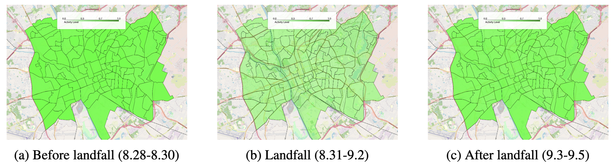
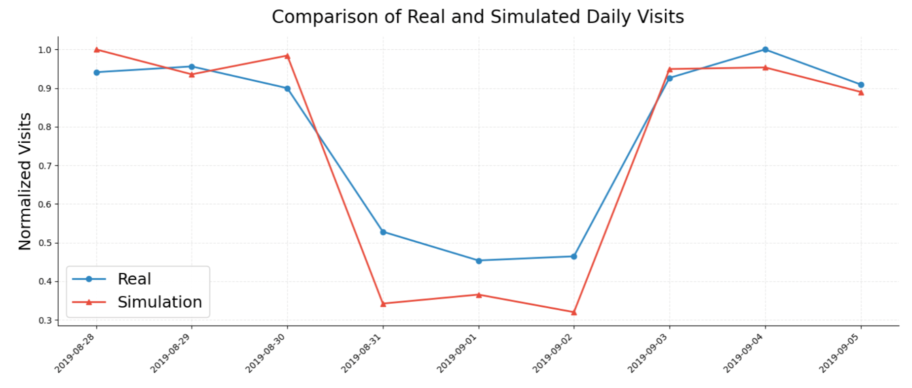

# External Shocks of Hurricane

The experiment focuses on analyzing the impact of Hurricane Dorian on human mobility in Columbia, South Carolina, using SafeGraph and Census Block Group data to model the movement behaviors of 1,000 social agents.

Codes are available at [Hurricane Impact](https://github.com/tsinghua-fib-lab/agentsociety/tree/main/examples/hurricane_impact).

## Background

Extreme natural disasters such as hurricanes exert profound impacts on social structures and individual behaviors, with understanding their disruptive effects on population mobility, infrastructure, and social stability being critical for optimizing emergency response strategies and mitigating disaster risks. 

This experiment simulates societal dynamics during a hurricane event to analyze behavioral patterns of individuals under disaster conditions. Grounded in the real-world context of Hurricane Dorian's 2019 impact on the southeastern United States, the study focuses on Columbia, South Carolina, as a representative case. The simulation integrates SafeGraph mobility data, which captures granular movement patterns within the urban area, and Census Block Group (CBG) datasets that provide demographic and socioeconomic characteristics. These data sources are synthesized to construct a population of 1,000 social agents, whose decision-making processes and behavioral adaptations—such as evacuation choices, resource allocation, and social interactions—are modeled to reflect real-world responses to hurricane threats.

## Reproducing Phenomena with Our Framework  

### Simulating Societal Dynamics

#### Workflow Design  

The experiment employs a phased approach to model temporal disaster impacts:  

```python
exp_config.SetWorkFlow([
    # Pre-disaster baseline (3 days)
    WorkflowStep(type=WorkflowType.RUN, days=3),  
    
    # Hurricane landfall intervention
    WorkflowStep(
        type=WorkflowType.INTERVENE,
        func=partial(update_weather_and_temperature, "wind"),
        description="Activate hurricane conditions"
    ),
    
    # Disaster phase (3 days)
    WorkflowStep(type=WorkflowType.RUN, days=3),  
    
    # Post-disaster recovery intervention
    WorkflowStep(
        type=WorkflowType.INTERVENE,
        func=partial(update_weather_and_temperature, "no-wind"),
        description="Restore normal weather"
    ),
    
    # Recovery phase (3 days)
    WorkflowStep(type=WorkflowType.RUN, days=3),  
])
```

The `update_weather_and_temperature` function modifies agents' perception of risk by broadcasting hurricane warnings (e.g., disrupted travel, high winds) or recovery signals.   

Agents within the environment autonomously adjust their mobility behaviors based on their perception of the environment.

### Data Collection and Metrics  

#### Mobility Tracking  
The `mobility_metric` extracts daily movement data from agents' `aoi_position` and `number_poi_visited` attributes, correlating with SafeGraph's granular mobility traces.  

```python
# Metric extraction configuration
exp_config.SetMetricExtractors(metric_extractors=[(1, mobility_metric)])
```

### Run the Codes

```bash
cd examples/hurricane_impact
python hurricane.py
```

## Experiment Result





The experimental results demonstrated that the movement patterns of the simulated agents during the hurricane event closely aligned with real-world data, with agent activity levels significantly decreasing as the hurricane approached and gradually recovering in the post-disaster period, mirroring actual human mobility trends observed in real-world scenarios. The temporal evolution of simulated population movements showed strong similarity to empirical mobility patterns, validating the simulator's capability to reproduce human behavioral responses under extreme weather conditions. 

This alignment between computational modeling and observed phenomena provides empirical support for leveraging such simulations to enhance disaster preparedness planning. These findings substantiate the utility of the simulation framework for informing and optimizing disaster response strategies through reliable behavioral modeling in crisis scenarios.
