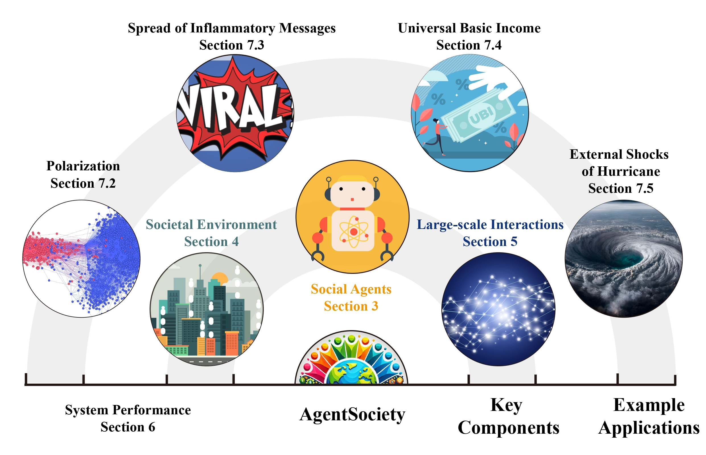

# AgentSociety

**AgentSociety** is a social simulation engine and a toolkit for social science research, constructed based on the first principles of sociology, utilizing large model agents. It aims to catalyze a paradigm shift in the methodology of social science research, promoting developments from behavioral simulation to mental modeling, from static deduction to dynamic coexistence, and from laboratory tools to social infrastructure.
The paper is available at [arXiv](https://arxiv.org/abs/2502.08691).



## Features

- 🌟 **Large Model-driven Social Human Agents**: Based on sociological theories, it constructs social agents with "human-like minds," endowing them with emotions, needs, motivations, and cognitive abilities. These agents perform complex social behaviors such as movement, employment, consumption, and social interactions driven by these mental attributes. We also support [customization of agents](./04-custom-agents/index.md).
- 🌟 **Realistic Urban Social Environment**: It accurately simulates urban spaces that are crucial for the survival of social humans, reproducing transportation, infrastructure, and public resources. This enables agents to interact under real-world constraints, forming a vivid social ecosystem.
- 🌟 **Large-scale Social Simulation Engine**: By employing an asynchronous simulation architecture and the [Ray](https://www.ray.io/) distributed computing framework, combined with agent grouping and [MQTT](https://mqtt.org/) high-concurrency communication, it achieves efficient, scalable interaction among agents and simulation of social behavior.
- 🌟 **Social Science Research Toolkit**: It comprehensively supports a series of sociological research methods including [interviews & surveys](./03-experiment-design/01-survey-and-interview.md), [message control tool](./03-experiment-design/03-message-interception.md), and [metrics extractors](./03-experiment-design/02-metrics-collection.md), providing various automated data analysis tools that facilitate in-depth social science research from qualitative studies to quantitative analyses.

## Online Demo

<!--  -->


We provide a [Online Demo](https://agentsociety.fiblab.net/exp/1a4c4fa5-04c1-4973-9433-b8b696f2fda0) of our simulation platform. 

Experience our online demo, which simulates the behavioral patterns of individuals during a hurricane event, grounded in the real-world context of Hurricane Dorian's impact on Columbia, South Carolina. 
Comprehensive details and use case explanations are available in [Hurricane Impact](./06-use-case/04-hurricane-impact.md).

## Installation

Refer to the quick start section for [prerequisites](./01-quick-start/01-prerequisites.md) and [installation](./01-quick-start/02-start-your-first-simulation.md#step-0-installation) instructions.

## Contact Us

We cordially invite scholars from social sciences, LLM, and agent fields, to explore our platform. 
Researchers may contact us with [Email](mailto:agentsociety.fiblab2025@gmail.com) and submit your research proposal. Approved applicants will receive beta credentials to conduct experiments on our platform with our team's guidance. 
 
We welcome collaborative opportunities to advance social science research through our platform.

## WeChat Group


## Table of Contents

```{toctree}
:maxdepth: 2

01-quick-start/index
02-configurations/index
03-experiment-design/index
04-custom-agents/index
05-ui-interface/index
06-use-case/index
07-advanced-usage/index
apidocs/index
```
