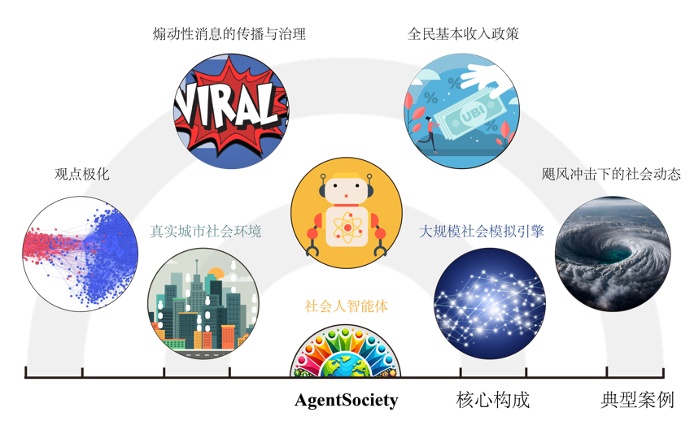
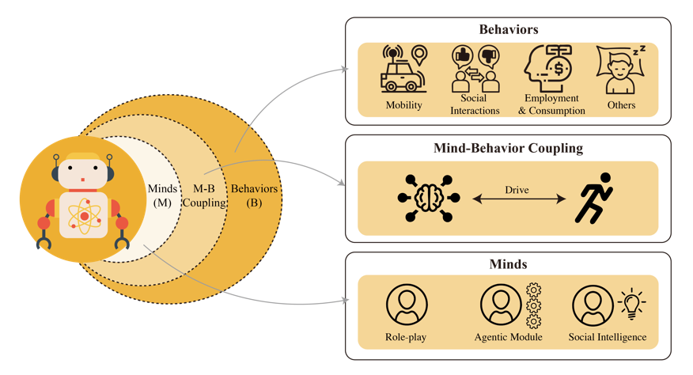
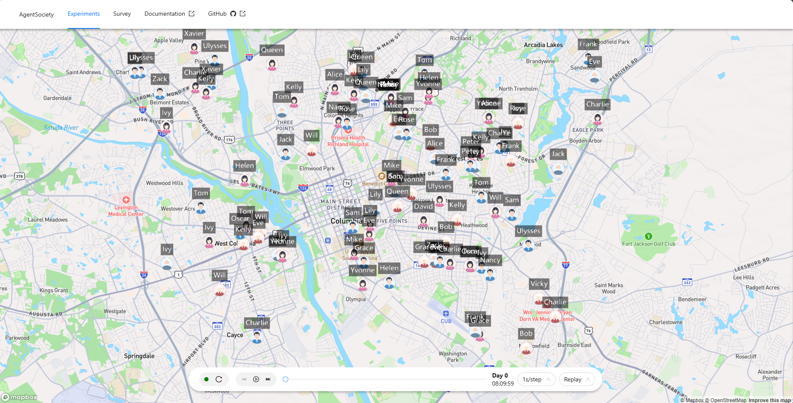

# AgentSociety

The Future Intelligence Lab (FIB) at Tsinghua University, in collaboration with interdisciplinary teams from the School of Public Policy & Management, the School of Social Sciences, and others, have leveraged the technological advantages of LLM agents, realistic social environment simulations, and large-scale simulation acceleration frameworks and successfully developed the Large Social Simulator **AgentSociety** version 1.0. 

Starting from the first principles of sociology, **AgentSociety** aims to catalyze a paradigm shift in the methodology of social science research, promoting developments from behavioral simulation to mental modeling, from static deduction to dynamic coexistence, and from laboratory tools to social infrastructure.




Our framework features:

- 🌟 **Large Model-driven Social Human Agents**: Based on sociological theories, it constructs social intelligent agents with "human-like minds," endowing them with emotions, needs, motivations, and cognitive abilities. These agents perform complex social behaviors such as movement, employment, consumption, and social interactions driven by these mental attributes.
- 🌟 **Realistic Urban Social Environment**: It accurately simulates urban spaces that are crucial for the survival of social humans, reproducing transportation, infrastructure, and public resources. This enables intelligent agents to interact under real-world constraints, forming a vivid social ecosystem.
- 🌟 **Large-scale Social Simulation Engine**: By employing an asynchronous simulation architecture and the Ray distributed computing framework, combined with intelligent agent grouping and MQTT high-concurrency communication, it achieves efficient, scalable interaction among intelligent agents and simulation of social behavior.
- 🌟 **Social Science Research Toolkit**: It comprehensively supports a series of sociological research methods including experiments, interviews, and surveys, providing various automated data analysis tools that facilitate in-depth social science research from qualitative studies to quantitative analyses.

## Social Agent Modeling




Social human agents constitute the core of **AgentSociety**. 
The design of social human agents is structured into three interconnected layers: mind, mind-behavior coupling, and behavior.

- **Mind Layer**: each agent is endowed with a stable individual profile (e.g., personality, age, gender) and dynamic personal states (e.g., emotions, economic status, social relationships) to ensure context-specific behavioral patterns. 
  Three core psychological processes govern agent behavior: emotions (immediate reactions to external stimuli, influencing short-term decisions such as cooperative tendencies under positive feedback), needs (intrinsic drivers based on Maslow’s Hierarchy of Needs, where agents prioritize survival and safety before pursuing higher-level goals like social belonging or self-actualization), and cognition (interpretation of social events, policy environments, and group dynamics, shaped by personality, past experiences, and evolving social interactions).

- **Mind-Behavior Coupling**: Agent behaviors are dynamically driven by the interplay of emotions, needs, and cognition, adjusted through interactions between personal states and external environments. 
  Drawing on Maslow’s Hierarchy of Needs and the Theory of Planned Behavior (TPB), we establish a pathway from psychological states to behavioral execution. Agents prioritize needs hierarchically (e.g., survival precedes social engagement) while proactively planning actions through cognitive evaluations of environmental constraints and goal feasibility, ensuring adaptive yet coherent long-term behaviors.

- **Behavior Layer**: Agents exhibit both simple and complex human-like social behaviors. Simple behaviors (e.g., sleep, diet, leisure) maintain physiological equilibrium and indirectly influence emotional states and social tendencies (e.g., sleep deprivation reduces social engagement). Complex social behaviors include:
Mobility (context-aware navigation with route optimization and transportation mode selection),
Social interactions (dynamic formation, maintenance, and evolution of relationships based on needs, emotions, and environmental cues), and
Economic activities (rule-compliant decisions in labor and consumption, modulated by economic status, market conditions, and individual preferences).

## Demo



We provide a [Demo](https://agentsociety.fiblab.net/exp/1a4c4fa5-04c1-4973-9433-b8b696f2fda0) of our simulation platform. 

## Installation
Linux AMD64 or macOs

Python >= 3.9

```bash
pip install agentsociety
```

## Contact Us

We cordially invite scholars from social sciences, LLM, and intelligent agent fields, to explore our platform. 
Researchers may contact us with [Email](mailto:agentsociety.fiblab2025@gmail.com) and submit your research proposal. Approved applicants will receive beta credentials to conduct experiments on our platform with our team's guidance. 
 
We welcome collaborative opportunities to advance social science research through our platform.

## Table of Contents

```{toctree}
:maxdepth: 2

01-quick-start
02-custom-agents/index
03-experiment-design/index
04-use-case/index
05-advanced-usage/index
apidocs/index
```
